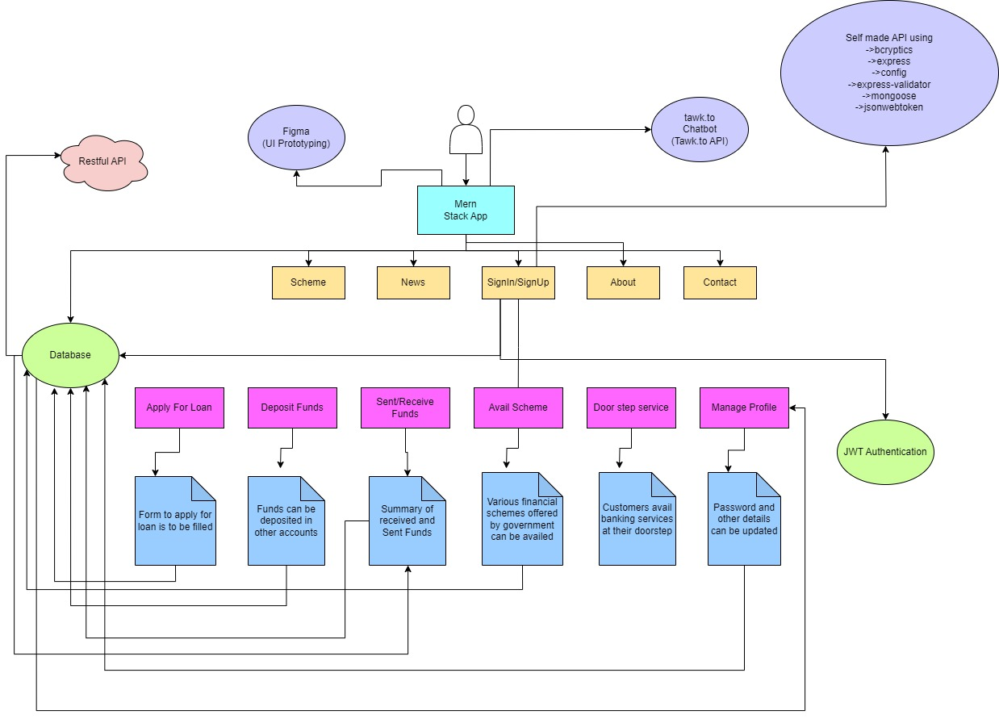

# Code Linguists - Digital Financial Services Prototype

Welcome to the Code Linguists' prototype for providing digital financial services in remote and inaccessible areas lacking connectivity and communication networks. Our innovative solution aims to empower residents of such regions economically and enhance financial inclusion. This README guide will walk you through the process of setting up and running the prototype for testing and analysis.

## Prototype Overview

Our prototype utilizes modern web technologies to provide seamless access to financial services. It consists of a web application built using the React framework for the front end, with Express and Node.js for the back end. The data is stored in a MongoDB database, and the user interface is designed using Figma and styled using CSS and Bootstrap.

Our prototype offers the following key features to address the challenge of providing digital financial services in remote areas:

1. **Account Creation:** Users can create new accounts by providing personal information and setting up a password.

2. **Loan Application:** Users have the ability to apply for loans by submitting financial details and specifying the loan amount needed.

3. **Funds Deposit and Transfer:** Users can deposit funds into their own accounts or transfer them to other users by providing account information and the desired amount.

4. **Government Financial Schemes:** Users can avail financial schemes offered by the government by applying and providing the necessary information.

## UML Diagrams

Below are the UML diagrams representing the architecture and flow of our prototype:

1. **Process Flow Diagram:**
   

## Tech Stack

The prototype is built using the following technologies:

- User Interface Design:
  - Figma

- Front End:
  - ReactJS
  - CSS
  - Bootstrap

- Back End:
  - Express
  - NodeJS
  - MongoDB

## Step-by-Step Code Execution Instructions

Follow these steps to clone and run the prototype on your local machine:

1. **Clone the Repository:**

   ```sh
   git clone https://github.com/your-username/CodeLinguists.git
   cd CodeLinguists
   ```

2. **Install Dependencies:**

   ```sh
   npm install
   cd client
   npm install
   ```

3. **Run the Prototype:**

   ```sh
   # In the root directory
   npm run dev
   ```

4. Access the prototype in your web browser at `http://localhost:3000`.

## Contact

For any inquiries or feedback, please feel free to reach out to the team leader:

- Taesha Mendiratta
- Email: taesha.mendiratta@gmail.com

We appreciate your interest in our prototype and look forward to your feedback!

## Key Learning: User-Centric Design

During the development of our digital financial services prototype, I discovered the profound significance of prioritizing user-centric design. This journey highlighted the following key insights:

1. **User-Centered Approach:**
   Empathizing with users in remote areas lacking connectivity was crucial. By focusing on their unique needs, we tailored our solution to address their challenges effectively.

2. **Iterative Design:**
   Embracing an iterative design process was vital. User feedback guided refinements, resulting in a more intuitive and user-friendly application.

3. **Accessibility and Inclusivity:**
   Designing for diverse digital literacy levels reinforced the importance of clear instructions, easy navigation, and accessibility features to ensure inclusivity.

4. **Human-Centered Solutions:**
   Our project underscored that technology can drive positive social impact. Creating solutions that empower users can lead to meaningful advancements in their lives.
