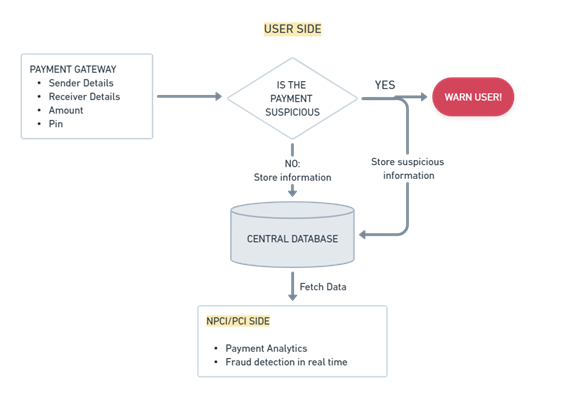

# National-Agrifunds-Hackathon

## Submission Instruction:
  1. Fork this repository
  2. Create a folder with your Team Name
  3. Upload all the code and necessary files in the created folder
  4. Upload a **README.md** file in your folder with the below mentioned informations.
  5. Generate a Pull Request with your Team Name. (Example: submission-XYZ_team)

## README.md must consist of the following information:

#### Team Name - AgriSafe
#### Problem Statement - Financial Inclusion in Remote Areas: Digital Financial Services for Unconnected Regions
#### Team Leader Email - hindeshnit19@gmail.com

## A Brief of the Prototype:
  This section must include UML Diagrams and prototype description
  
  
## Tech Stack: 
   Streamlit: Web-development\
  Google Sheets: Backend database\
  Python libraries: Scikit-learn, pandas, numpy

   
## Step-by-Step Code Execution Instructions:
      ```
      1. Clone the repository
      2. streamlit run main.py
      ```
  
## What I Learned:
   From this project I learned that providing the payment solution is important but securing that solution and creating alerts is very important for a payment solution
