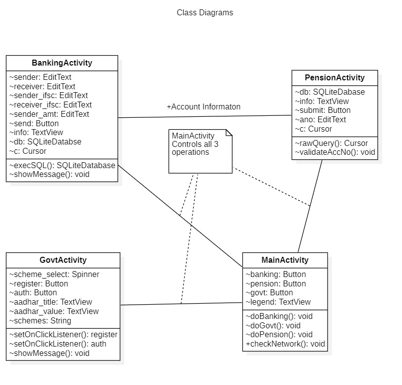
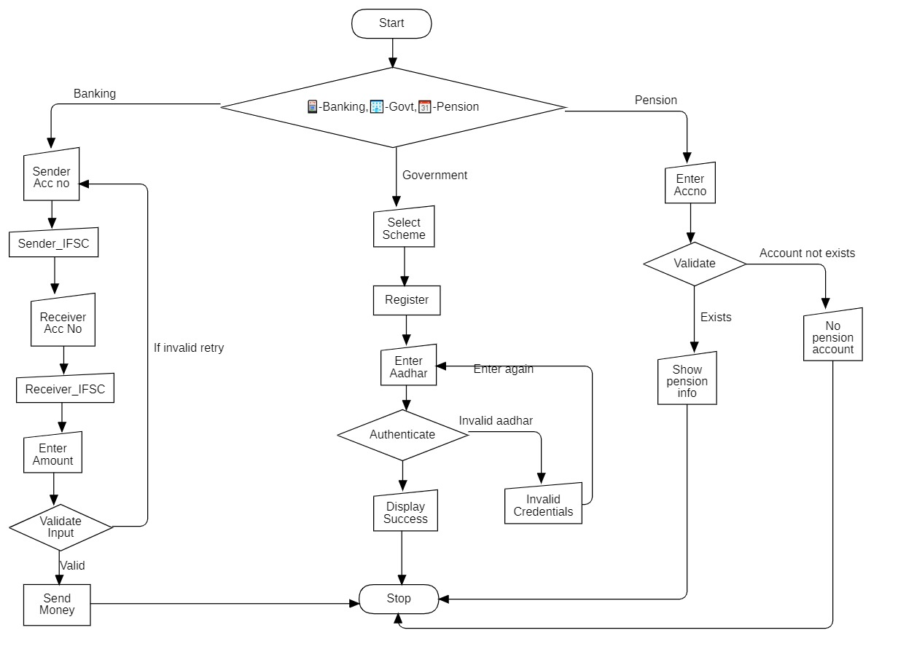
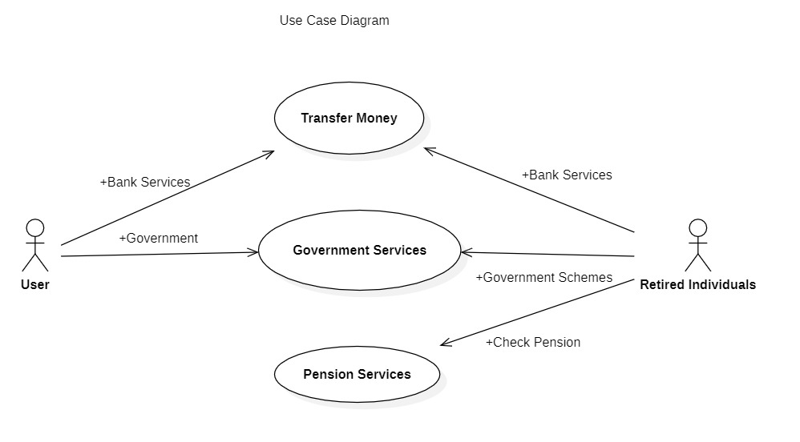
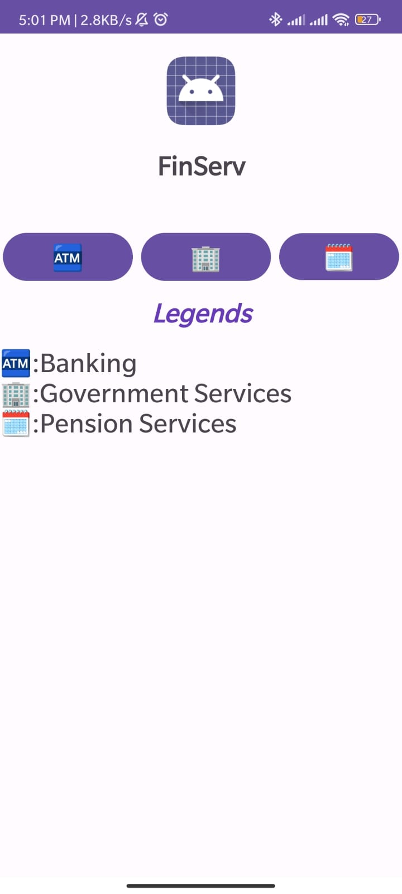
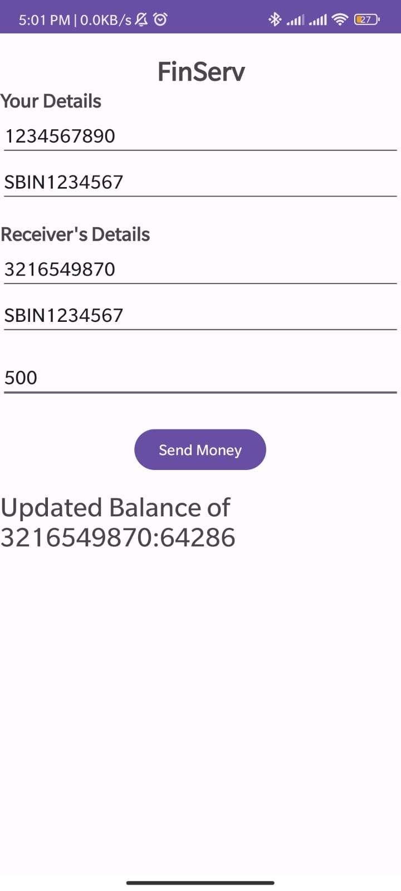
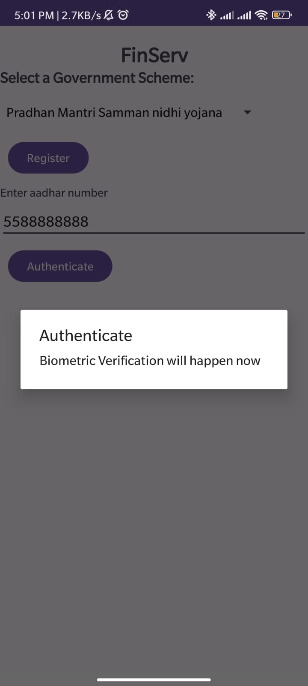
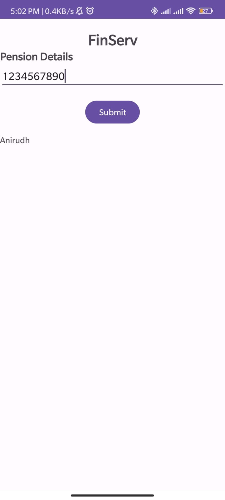

# National-Agrifunds-Hackathon


#### Team Name - BMSIT MCA
#### Problem Statement - Financial Inclusion in Remote Areas: Digital Financial Services for Unconnected Regions 
#### Team Leader Email - anirudhparvatikar12@gmail.com

## A Brief of the Prototype:

  Our prototype is an Android app designed to provide seamless financial services to individuals in areas with limited internet connectivity. By combining user-friendly design with robust technology, our app ensures easy access to banking services, even for those with minimal digital literacy. Here's a brief overview of the prototype's key features:

  1. User-Friendly Interface:Our app boasts a simple and intuitive user interface, carefully designed to cater to users of all technological backgrounds.

  2. Connectivity Adaptibility: One of the standout features of our prototype is its adaptability to different connectivity scenarios.

  3. Internet Connectivity: In the presence of an internet connection, our app establishes a connection with the bank servers and facilitates seamless transactions.

  4. SMS Connectivity: In the absence of an internet connection, our app automatically switches to SMS mode, allowing users to perform transactions through SMS.

  5. Regular Backups: Our app regularly backs up all transactions to ensure that users can recover their data in case of any errors.

  Uml class diagram, Flowcharts, Screenshots, etc. can be used to explain the prototype. 

  1. Class Diagram

  

  2. Flowchart

  

  3. Use case


  

  4. Screenshots

  
  
  
  

  
## Tech Stack:
  The protoype is built using the following tech stack:
  1. Java
  2. Layouts and user interface
  3. Intents and navigation
  4. SQLiteDatabase
  5. Android Studio
   
## Step-by-Step Code Execution Instructions:
  1. Clone the repository
  
   ```git clone https://github.com/anirudhp06/National-Agrifunds-Hackathon.git```

   
  2. Make sure you are on the `mobile` branch
 
  ```git checkout mobile```

  
  3. Open the project in Android Studio
  4. Run the project on an emulator or a physical device
  
## What I Learned:
  Participating in a hackathon as a team of four, we embarked on a journey to design and implement an Android app that would revolutionize financial services for individuals with limited internet connectivity. Our solution aimed to provide seamless access to bank services, ensuring that even those with limited digital literacy could navigate the app effortlessly.
  Our app was designed to establish a connection with bank servers through the internet, with a seamless fallback to SMS services in the absence of an internet connection. Additionally, we incorporated regular backups to safeguard transactions and facilitate recovery in case of any errors. Through this experience, we not only developed technical skills but also gained insights into teamwork, empathy-driven design, and the importance of innovation in addressing real-world challenges.

## Skills Acquired:
  1. Android Development
  2. Java
  3. Kotlin
  4. SQLite Database
  5. Android Studio
  6. Git and Github
  7. Teamwork
